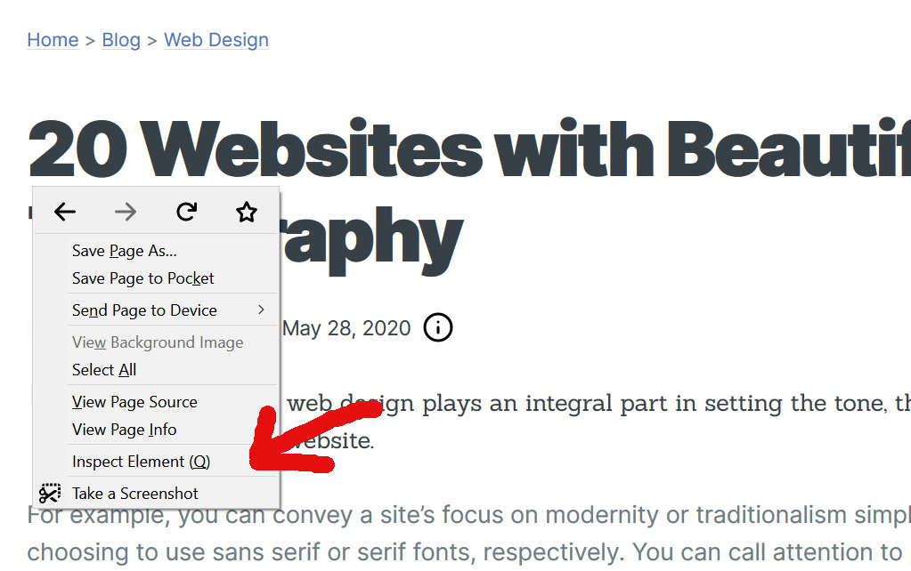
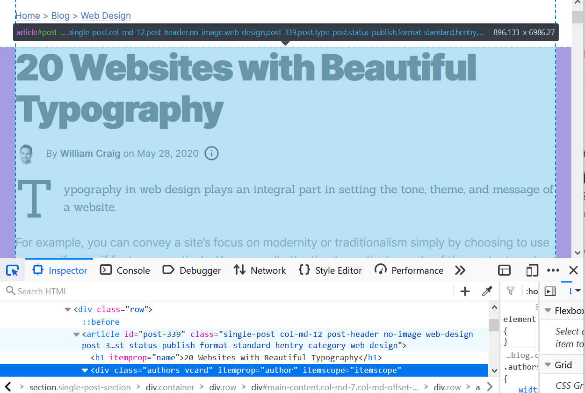
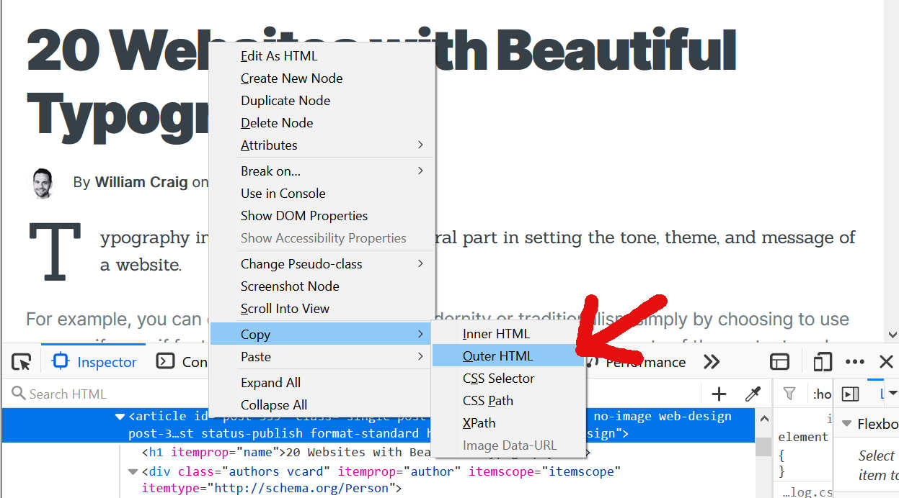
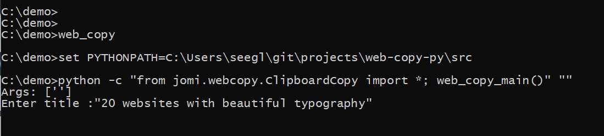
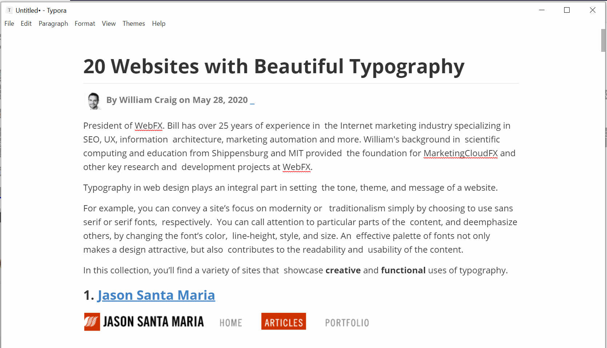

# Web Copier

Tool to copy website content to a local file preserving its original  formatting as it is rendered in browser. Handy to copy blogs or infographics to local html or  markdown without loosing its typesetting or image layouts        

### Motivation

Needed a local copy of good blogs and infographic pages which I have been researching recently. Using "Save" option in the browser often creates lots of files with long names and nested folders. Most of those downloaded files are either advertisement or scripts related to  unwanted page content.

Also needed to keep these downloaded files in an organized way for future reference.

So wrote a small script and a process to do this quickly

### Installation and User Guide

#### Requirements

* Python 3.0
* Tested on Linux and Windows

#### Install

* Clone git files

  ```
  git clone git@github.com:seegler/web-copier.git
  ```

* Install python modules

  ```
  pip install django-utils
  pip install win32clipboard #on windows
  pip install beautifulsoup
  
  ```

* Install **xclip** on Linux

  ```
  sudo apt install xclip
  ```

#### How to Use

* Select and copy the area of the webpage to clipboard

  * Right click on the content area in the browser and choose ``Inspect Element``

    

    

  * Highlight the content using the Inspect tool 

    

    

  * Copy ``OuterHTML`` to clipboard

    

    

    

* Run web-copy from a folder where you want all the files. Web-Copy downloads all images and updates the html with local links

  

  ```
  c:\demo> git_folder\web-copy-py\src\web_copy.bat
  #Enter title when prompted. All downloaded files will be in a folder derived from title
  Enter title:"20 websites with beautiful typography"
  #Press Enter
  #Now Web-copy downloads all files and creates sources.html
  ```

* View downloaded file

  Open ``sources.html`` in browser

* Copy (CTRL-A + CTRL-C) and paste the content from browser to your favorite writer. I am using ``Typora`` 

  

  

### Code Details

* Format the title to a sanitized file name

* Download the clip board to ``sources.html_`` file

  * Uses ``xclip`` on Linux
  * Uses ``win32clipboad`` module on Windows

* Parse ``sources.html_`` using ``beautifulsoup``.

  * Apply site specific filters

    ```
    See "web-copy -m medium" option. This filters noscript and srcset images from medium blog sites. 
    ```

  * Extract img links and download images

  * Modify image links to downloaded local files

* Save file html in ``sources.html``

### Revision History

#### <u>Version1</u>